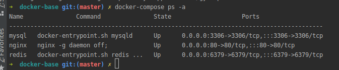

# Estrutura basica para configuração de ambiente com docker 
```
PHP - 8.1 + Laravel / Lumen
MySql - 8.0
Redis 
Nginx 
```
## Requisitos
```
docker 
docker-compose
```

## Instalação docker & docker-compose:
 [LINUX](https://www.digitalocean.com/community/tutorials/how-to-install-and-use-docker-compose-on-ubuntu-20-04-pt)
 
 [WINDONS](https://docs.docker.com/desktop/install/windows-install/)
 
 [MAC](https://docs.docker.com/desktop/install/mac-install/)

## Após clonar

Rode os comandos a seguir na pasta do projeto:
```
docker-compose up -d --build
```
```
Isso subirá o seu ambiente de desenvolvimento
```

### Verifique o do status do ambiente com o comando:

```
docker-compose ps -a
```

### Vai aparecer algo semelhante a isso:



Sua base para desenvolvimento está pronta.

## Para usar em seu projeto:

```
Na raiz desse projeto, cria uma pasta chamada "applications" e clone seu projeto dentro dela.
```

#### Na RAIZ do projeto "docker-base" navegue até:
```
docker-exemplo-projeto > estrutura-compartilhada.

Copie a pasta "docker" e o arquivo docker-compose.yml e cole na raiz do seu projeto.
```
#### Após copiar. Agora na raiz do seu projeto navegue: Ex.: 

```
api-fatura > nome da pasta do projeto
       |__ app
       |__ bootstrap
       
*estrtura de pasta do projeto - laravel
```
```
docker > build > nginx 

mude o nome do arquivo .conf para o nome do seu projeto. 
Ex.: api-fatura.conf

Dentro do arquivo, mude todos os "api-exemplo" para no nome da pasta do seu projeto
Ex.: a pasta raiz do meu projeto chama-se "api-fatura", entao mudo para "api-fatura^.
```
#### Agora dentro de init-docker-dev.sh
```
Trocar todos os "api-exemplo.conf" para o nome dado no passo anterior.
Ex.: no exemplo dado "api-fatura.conf"

Onde está "api-exemplo-container" mudará para o nome da pasta do seu projeto.
Ex.: no exemploda dado ficará "api-fatura"
```
#### Agora dentro de docker-compose.yml
```
Trocar todos os "api-exemplo" para o nome dado no passo anterior.
```

### Após as mudancças:
```
No seu terminal navegue até seu projeto:
 - cd applications/api-fatura * tecle enter
 - rode o comando: docker-compose up -d --build
Após rodar:
 - execute: bash docker/init-docker-dev.sh
```

Se tudo ocorrer corretamente seu projeto estara configurado.

Nome do container nesse exmplo: api-fatura
### Comandos uteis

```
Executando bash do container.
- docker-compose exec <container-name> bash
  - executara o terminal dentro do container, com isso vc pode rodar as config do laravel aqui.
   - Ex.: 
       - composer install
       - cp .env.example .env
       - <comandos artisan>

Executando comandos sem entrar no container
- docker-compose exec <container-name> <command>
 - Ex.:
  - docker-compose exec api-fatura composer install
  - docker-compose exec api-fatura cp .env.example .env
  - docker-compose exec api-fatura <comandos artisan>
```
 ### Acessos
 ```
 url projeto:
 https://<projeto-name>.localhost
 
 Banco MySql
  - host para o "DBiever" ou "workbench" ou qualqueroutra "IDE" de banco: localhost
  - host para o .env do projeto: "mysql" obs.: nome do container do ambiente 
  - porta: 3306
  - password: 123
  
 Nginx:
  - localhost:80
  
 Redis
  - host: redis - contaner name
  - porta: 6379
  
 Esass infos estao no .env do "docker-base"
``` 
### Acesso do exemplo
```
https://api-fatura.localhost>
```

# Descer ambiente 
```
Dentro de applications > <my-project> 
executar: docker-compose down obs.: derrubara apenas esse projeto

Dentro de docker-base 
executar: docker-compose down obs.: derrubara todo o ambiente de desenvolvimento.
```
 


